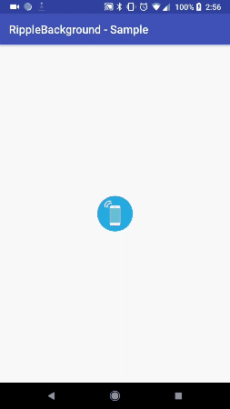

# Android Ripple Background

A beautiful ripple animation for your app. You can easily change its color, speed of wave, one ripple or multiple ripples. See demo below.

MAIN DIFFERENECE BETWEEN THIS FORK AND ORIGINAL:
1. This library auto scale to the border of the view, not just "6" times bigger. You don't have to specify rb_scale
2. Remove stroke width, it was not working well and pixelated even from the original library.
3. You can use any icon you want! Not just circle! Using icon would ignore all properties for circle(color, fill/stroke)

　　　　　　

##Usage

###Step 1

####Install with Gradle

```groovy
allprojects {
		repositories {
			...
			maven { url 'https://jitpack.io' }
		}
	}
```


```groovy
dependencies {
        implementation 'com.github.jeffreyliu8:android-ripple-background:1.0.1'
}
```
###Step 2
####RippleBackground

Add `RippleBackground` to your layout with content you want, like an ImageView. Configure the view customization elements using styleable attributes. NOTE: RippleBackground extends FrameLayout, not RelativeLayout 
 
```xml
    <com.askjeffreyliu.library.RippleBackground
        android:id="@+id/rippleBackground"
        android:layout_width="match_parent"
        android:layout_height="match_parent"
        app:layout_constraintBottom_toBottomOf="parent"
        app:layout_constraintEnd_toEndOf="parent"
        app:layout_constraintStart_toStartOf="parent"
        app:layout_constraintTop_toTopOf="parent"
        app:rb_color="#0099CC"
        app:rb_duration="3000"
        app:rb_radius="32dp"
        app:rb_rippleAmount="6"
        app:rb_scale="6" <!-- Optional -->
        app:rb_icon="@drawable/ic_launcher"> <!-- NEW -->

        <ImageView
            android:id="@+id/centerImage"
            android:layout_width="64dp"
            android:layout_height="64dp"
            android:layout_gravity="center"
            android:src="@drawable/phone1" />

    </com.askjeffreyliu.library.RippleBackground>
```
Start animation:

```java
    final RippleBackground rippleBackground=(RippleBackground)findViewById(R.id.content);
    ImageView imageView=(ImageView)findViewById(R.id.centerImage);
    imageView.setOnClickListener(new View.OnClickListener() {
        @Override
        public void onClick(View view) {
            rippleBackground.startRippleAnimation();
        }
    });
```
Stop animation:

```java
    rippleBackground.stopRippleAnimation();
```

##Theming
* app:rb_color [color def:@android:color/holo_blue_dark] --> Color of the ripple
* app:rb_radius [dimension def:64dp ] --> Radius of the ripple
* app:rb_duration [integer def:3000 ] --> Duration of one ripple animation (millisecond) 
* app:rb_rippleAmount [integer def:6] --> Max amount of ripples at one screen
* app:rb_scale [interger def:view size] --> Scale of ripple at the end of animation, if not specified , scale to view border
* app:rb_type [enum (fillRipple, strokeRipple) def:fillRipple] --> Filled circle or ring( ring not recommended)
* app:rb_icon [reference def:none] --> NEW!!! The drawable from your resources, THIS OVERRIDE THE CIRCLE RIPPLE, remove this if you want the default circle

Removed:
* app:rb_strokeWidth [dimension def:2dp] --> Stroke width of the ripple, ONLY work when rb_type="strokeRipple"
